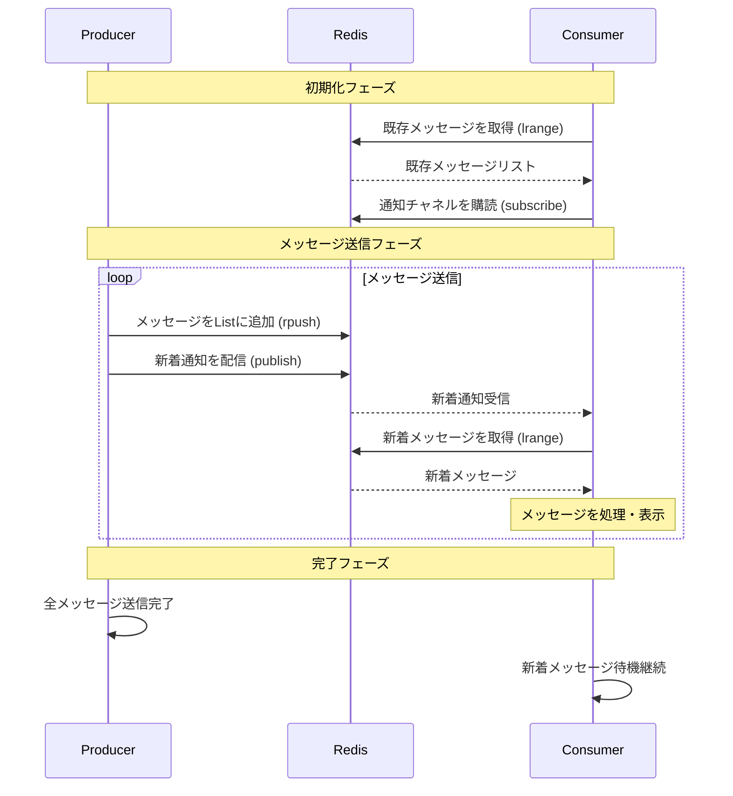
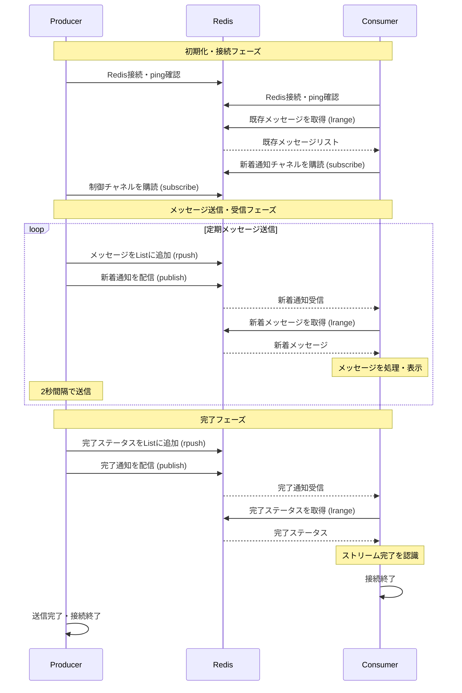
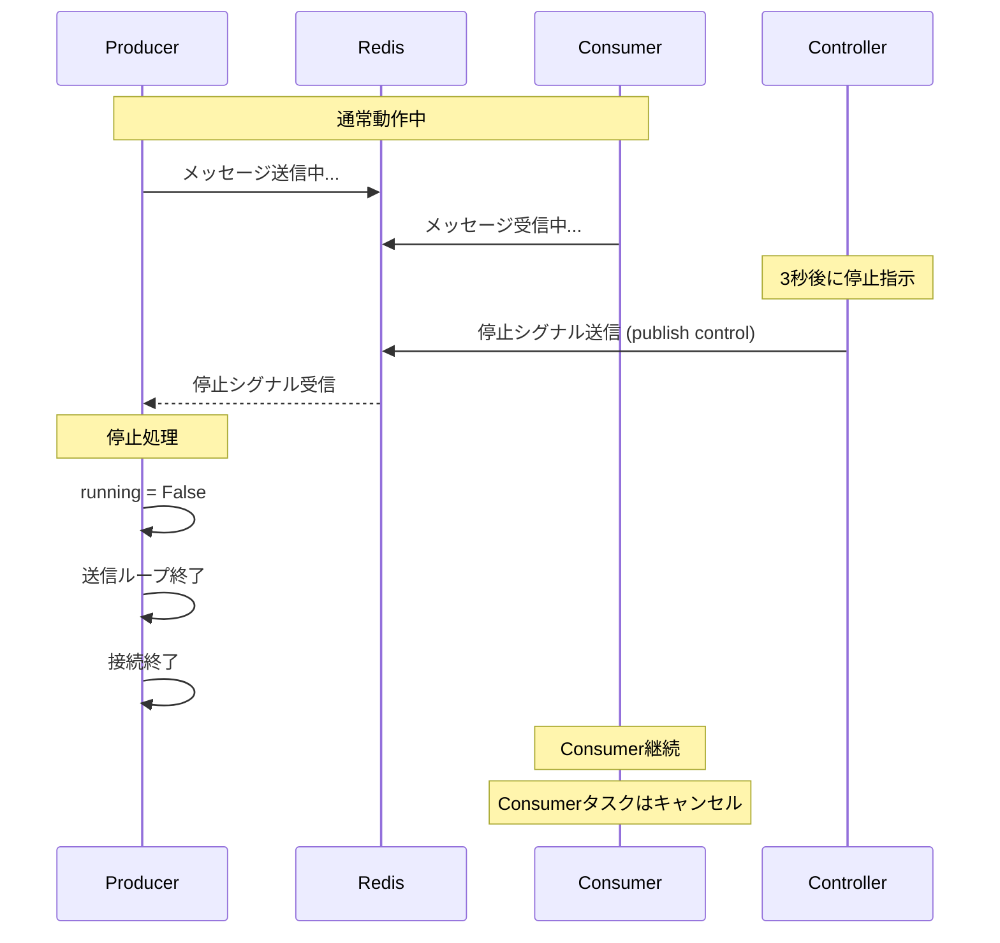
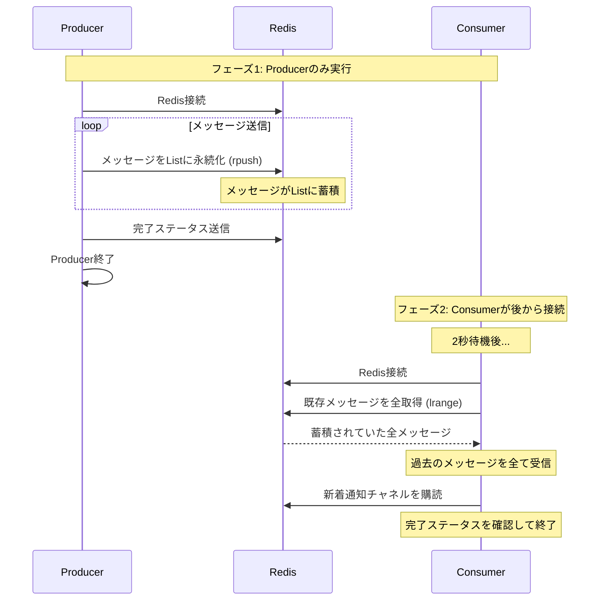

# redis-pubsub-sample

このプロジェクトは、RedisのList + Pub/Subパターンを使ったリアルタイムメッセージングシステムのサンプル実装です。
[kortix-ai/sun](https://github.com/kortix-ai/suna) の実装を参考にしています。

## 必要な環境

- Docker
- Python 3.13+
- uv (Pythonパッケージマネージャー)

## セットアップ手順

### 1. Redisサーバーの起動

#### 方法1: Docker Compose (推奨)

```bash
# Redisサーバーを起動
docker-compose up -d

# 起動確認
docker-compose ps
```

#### 方法2: Docker直接実行

```bash
# Redisコンテナを起動（バックグラウンド実行）
docker run -d --name redis-server -p 6379:6379 redis:latest

# 起動確認
docker ps
```

### 2. Python環境のセットアップ

```bash
# 依存関係をインストール
uv sync

# 仮想環境をアクティベート
source .venv/bin/activate
```

### 3. サンプルプログラムの実行

#### 最小限のサンプル実行

```bash
REDIS_HOST=localhost REDIS_PORT=6379 python src/redis_pubsub_minimal.py
```

このサンプルでは：
- Producer（送信側）とConsumer（受信側）が並行実行されます
- リアルタイムでメッセージが送受信される様子を確認できます

#### 実践的なサンプル実行

```bash
REDIS_HOST=localhost REDIS_PORT=6379 python src/redis_pubsub_sample.py
```

このサンプルでは：
- より実践的なメッセージングシステムの実装を確認できます
- セッション制御、停止機能、再接続機能などが含まれています

## Redisサーバーの停止

### Docker Composeを使用した場合

```bash
# Redisサーバーを停止
docker-compose down

# データも削除する場合
docker-compose down -v
```

### Docker直接実行の場合

```bash
# Redisコンテナを停止・削除
docker stop redis-server
docker rm redis-server
```

## プロジェクト構成

```
├── src/
│   ├── redis_pubsub_minimal.py    # 最小限のサンプル実装
│   └── redis_pubsub_sample.py     # 実践的なサンプル実装
├── docker-compose.yml             # Docker Compose設定
├── pyproject.toml                 # プロジェクト設定・依存関係
├── uv.lock                        # 依存関係のロックファイル
└── README.md                      # このファイル
```

## 実装パターン

このサンプルでは以下のRedisパターンを実装しています：

1. **List**: メッセージの永続化（履歴保存）
2. **Pub/Sub**: リアルタイム通知（新着メッセージの配信）

この組み合わせにより、以下の特徴を持つシステムを構築できます：
- メッセージの永続化（サーバー再起動後も履歴が残る）
- リアルタイム配信（新着メッセージの即座な通知）
- 複数クライアントでの同期（同じセッションを複数で監視可能）

## システム動作のシーケンス図



### シーケンス図の説明

1. **初期化フェーズ**
   - Consumer が Redis から既存のメッセージ履歴を取得
   - 通知チャネルを購読して新着メッセージの待機を開始

2. **メッセージ送信フェーズ**
   - Producer がメッセージを Redis List に永続化
   - 同時に Pub/Sub チャネルで新着通知を配信
   - Consumer が通知を受信し、新着メッセージを取得・処理

3. **完了フェーズ**
   - Producer は送信完了後に終了
   - Consumer は継続して新着メッセージを待機

## 実践的なサンプルのシーケンス図

実践的なサンプル（`redis_pubsub_sample.py`）では、より複雑なシナリオに対応しています：

### 通常フローのシーケンス図



### 途中停止シナリオのシーケンス図



### 再接続シナリオのシーケンス図



### 実践的サンプルの特徴

1. **セッション制御機能**
   - 制御チャネルによる停止シグナル
   - Producer の graceful shutdown

2. **メッセージタイプの分類**
   - `message`: 通常のメッセージ
   - `status`: システムステータス（完了通知など）

3. **永続性の活用**
   - Consumer が後から接続しても過去のメッセージを取得可能
   - Redis List による確実なメッセージ保存

4. **エラーハンドリング**
   - Redis 接続確認（ping）
   - 適切なリソース解放

## トラブルシューティング

### Redisに接続できない場合

1. Dockerコンテナが起動しているか確認：
   ```bash
   # Docker Composeの場合
   docker-compose ps

   # Docker直接実行の場合
   docker ps
   ```

2. ポート6379が使用可能か確認：
   ```bash
   lsof -i :6379
   ```

3. Redis接続テスト：
   ```bash
   docker exec -it redis-server redis-cli ping
   ```

### Python環境の問題

1. 仮想環境がアクティベートされているか確認
2. 依存関係の再インストール：
   ```bash
   uv sync --reinstall
   ```
